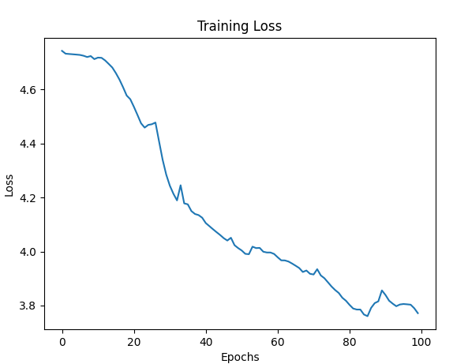
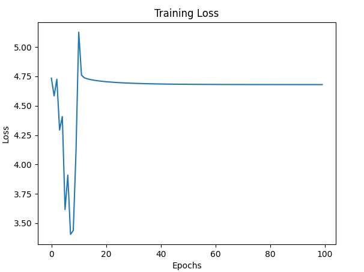
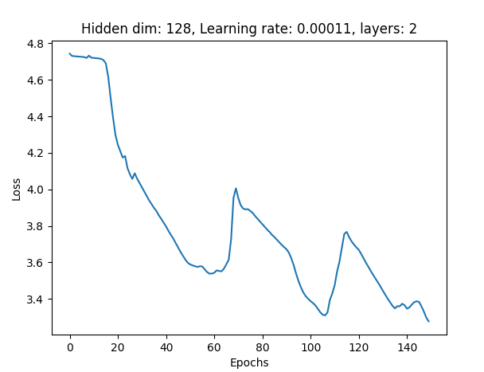

### Experiments 1
```    
    hidden_dim = 256  
    num_layers = 2  
    learning_rate = 0.0001
    epochs = 50
```
Loss: 4.7461 --> 3.7217

### Experiments 2
```
    hidden_dim = 128  
    num_layers = 2  
    learning_rate = 0.0001
    epochs = 100
```
Loss: 4.7425 --> 3.7717



### Experiments 3
```
    hidden_dim = 512  
    num_layers = 3  
    learning_rate = 0.00015
    epochs = 100
```



### Experiments 4
```
    hidden_dim = 128  
    num_layers = 2  
    learning_rate = 0.00011
    epochs = 50
```
Loss: 4.7432 --> 3.7218

### Experiments 5
```
    hidden_dim = 128  
    num_layers = 2  
    learning_rate = 0.00011
    epochs = 150
```
Loss: 4.7435 --> 3.2769
